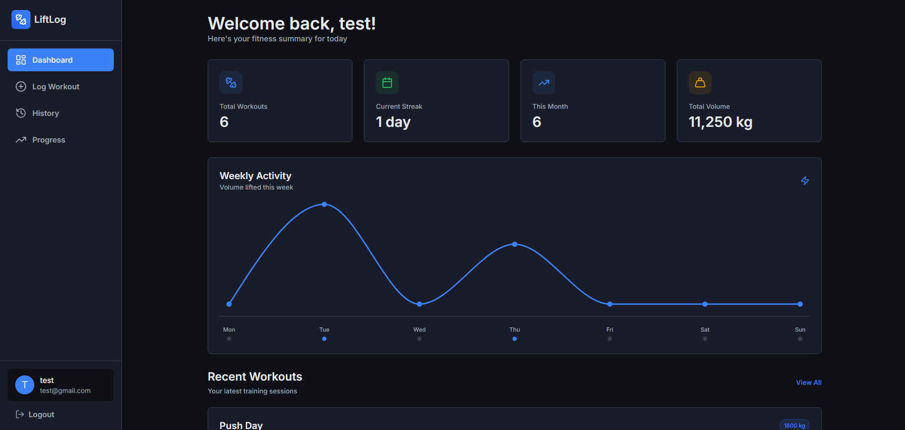
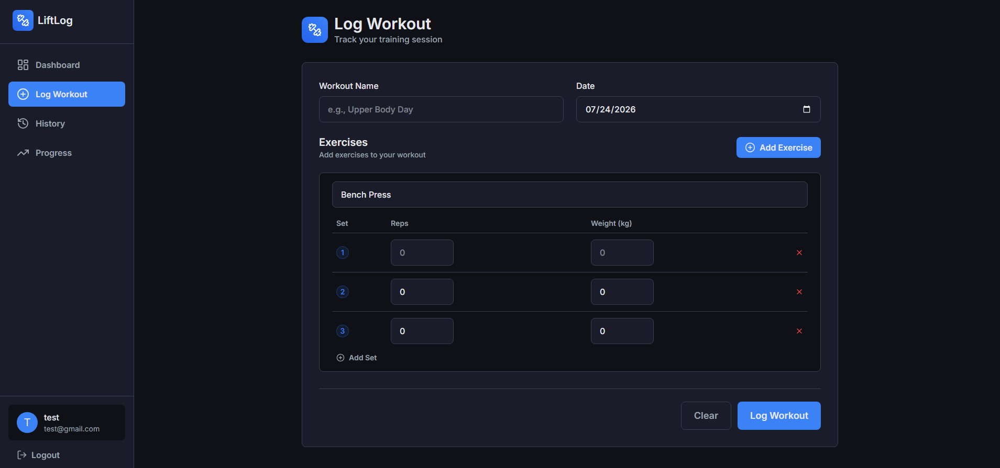
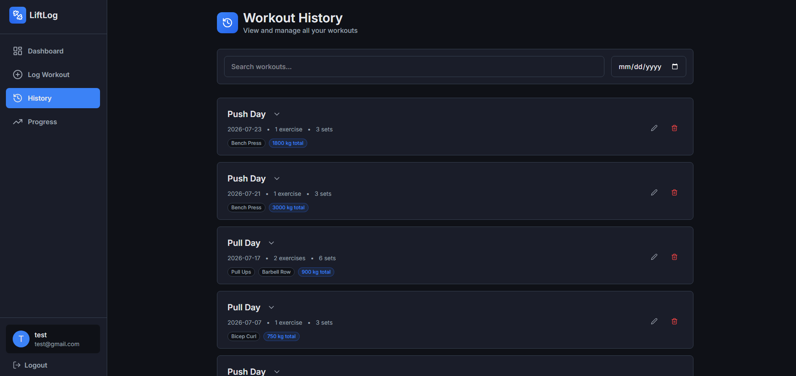
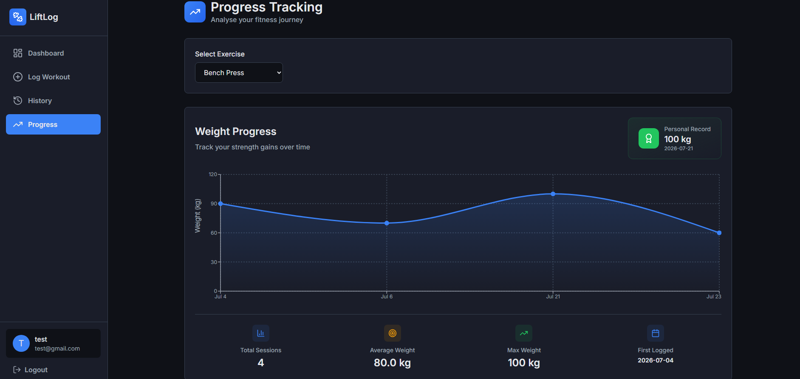
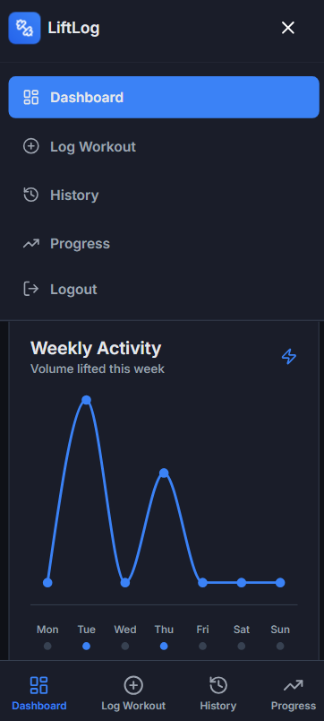

# LiftLog

A full-stack workout tracking app for logging exercises, monitoring progress and analysing training data. Built as a portfolio project to practise full-stack development with Next.js and TypeScript.

**Live Demo:** https://lift-log-phi-six.vercel.app/

---

## Features

- **Authentication** — secure registration and login with hashed passwords, JWT sessions and route protection via middleware
- **Workout Logging** — log workouts with dynamic exercise and set management, including a searchable exercise library and custom exercise creation
- **Workout History** — browse, filter, edit and delete past workouts with a full exercise and set breakdown per session
- **Progress Tracking** — visualise strength gains over time with an area chart per exercise, personal record display and session statistics
- **Dashboard** — a summary including total workouts, current streak, monthly activity, total volume lifted, weekly activity chart, recent workouts and personal records
- **Responsive Design** — mobile-first layout with a bottom navigation bar, hamburger menu and sidebar on desktop

---

## Tech Stack

**Frontend**
- Next.js 15 (App Router)
- TypeScript
- Tailwind CSS v4
- Recharts
- React Hook Form + Zod
- Lucide React

**Backend**
- Next.js Server Actions and Server Components
- Prisma ORM
- PostgreSQL (Neon)
- NextAuth.js v4 (JWT strategy)
- Argon2 password hashing

---

## Screenshots

**Dashboard**

**Log Workout**

**History**

**Progress**

**Mobile**

---

## Database Schema

The app uses a relational PostgreSQL schema with the following models:

- **User** — stores credentials and links to workouts and custom exercise templates
- **Workout** — belongs to a user, contains ordered exercises
- **Exercise** — belongs to a workout, references an exercise template, contains ordered sets
- **Set** — belongs to an exercise, stores reps and optional weight
- **ExerciseTemplate** — global or user-created exercise definitions with muscle group categorisation